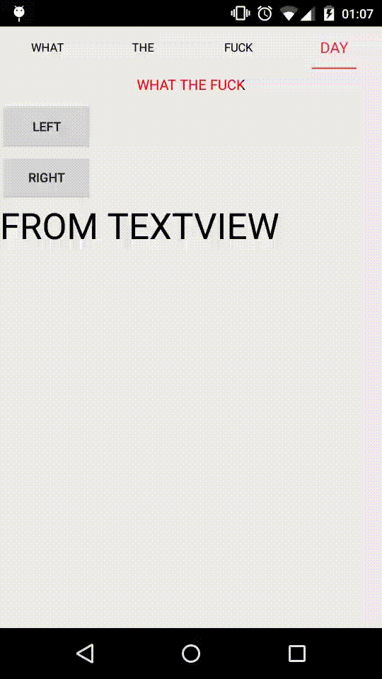

[](https://android-arsenal.com/details/3/2574)
# GradientTabStrip
Pretty awesome effect of ViewPager
> **GradientTabStrip** Change from [PagerSlidingTabStrip](https://github.com/astuetz/PagerSlidingTabStrip)
Pretty awesome effect of ViewPager




##USAGE
```java
 Just use as PagerSlidingTabStrip
         //tab text color
         strip.setTextColor(Color.parseColor("#000000"));
         //tab chose text color
         strip.setTabChoseTextColor(Color.parseColor("#df322e"));
         //tab text size
         strip.setTextSize(13);
         //tab chose text size
         strip.setTabChoseTextSize(17);
         //indicator color
         strip.setIndicatorColor(Color.parseColor("#df322e"));
         //indicator height
         strip.setIndicatorHeight(4);
         //underline height
         strip.setUnderlineHeight(1);
         //expand?
         strip.setShouldExpand(true);
         //divider between tab
         strip.setDividerColor(android.R.color.transparent);
```

##TODO
~~Maybe animate textview in tab when scroll viewpager~~

Thinking.....

## License

Copyright 2015 Bruce too

Licensed under the Apache License, Version 2.0 (the "License");
you may not use this file except in compliance with the License.
You may obtain a copy of the License at

    http://www.apache.org/licenses/LICENSE-2.0

Unless required by applicable law or agreed to in writing, software
distributed under the License is distributed on an "AS IS" BASIS,
WITHOUT WARRANTIES OR CONDITIONS OF ANY KIND, either express or implied.
See the License for the specific language governing permissions and
limitations under the License.

See [LICENSE](LICENSE) file for details.

